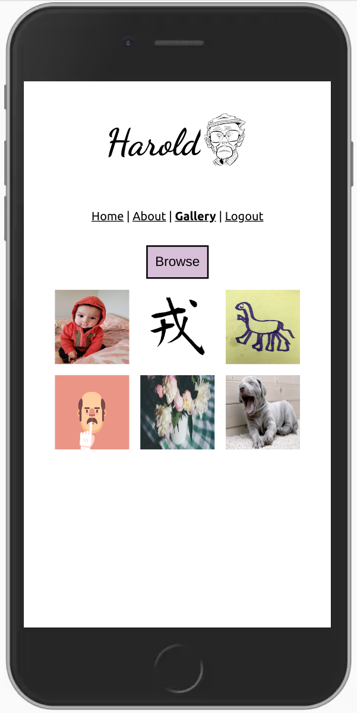
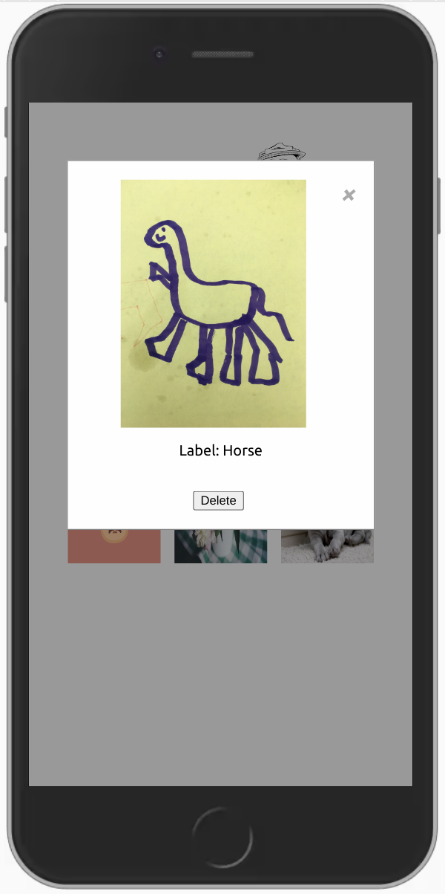

# Harold... client

Harold is designed to help you figure out just what exactly that image is... He'll apply a label to any image that you upload/snap a picture of!

## Scripts

Start the application `npm start`

## Screenshots

Home:

About:

Gallery View:

Modal View:

## Built With

- React 🔥

## Demo

- [Live Demo](https://image-analyzer.vercel.app/)

## Link to Server

- [Server](https://github.com/losmanzanos/gratitudes-server)

## Author

**Chad Moravec**

🚀🚀🚀
